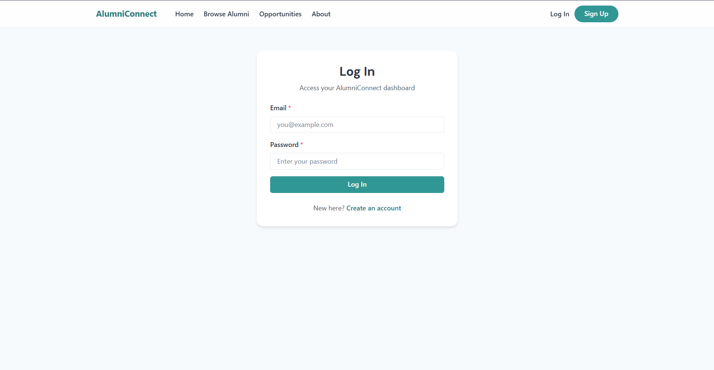
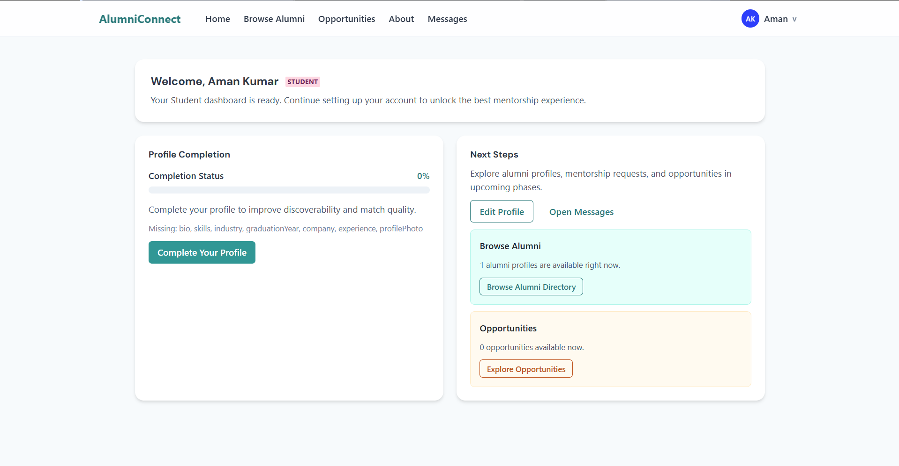
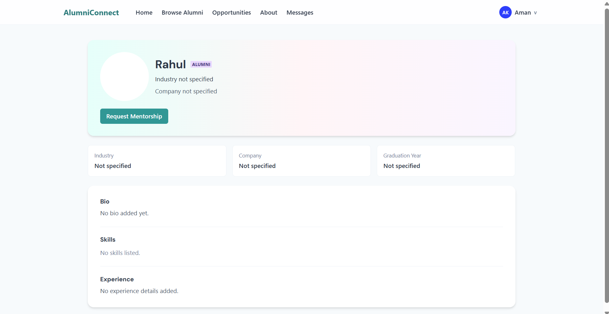

<div align="center">

# 🎓 AlumniConnect

### College Alumni Networking & Mentorship Platform

*Bridging the gap between students and alumni — one mentorship at a time.*

[](https://developer.mozilla.org/en-US/docs/Web/JavaScript)
[](https://reactjs.org/)
[](https://nodejs.org/)
[](https://mongodb.com/)
[](https://expressjs.com/)
[](LICENSE)

[Report a Bug](../../issues) · [Request a Feature](../../issues)

</div>

---

## 📖 Table of Contents

* [About the Project](#-about-the-project)
* [Features](#-features)
* [Tech Stack](#-tech-stack)
* [Architecture](#-architecture)
* [Getting Started](#-getting-started)

  * [Prerequisites](#prerequisites)
  * [Installation](#installation)
  * [Environment Variables](#environment-variables)
  * [Running the App](#running-the-app)
* [User Roles](#-user-roles)
* [API Reference](#-api-reference)
* [Database Schema](#-database-schema)
* [Project Structure](#-project-structure)
* [Screenshots](#-screenshots)
* [Project Demo Videos](#-project-demo-videos)
* [Future Scope](#-future-scope)
* [Contributing](#-contributing)
* [License](#-license)

---

## 🌟 About the Project

**AlumniConnect** is a full-stack web platform designed to bridge the gap between college students and alumni. Students can discover mentors, send mentorship requests, explore job and internship opportunities, and communicate directly — all within a single, structured environment.

The platform eliminates the problem of scattered, unorganized alumni networks on social media by providing a centralized, role-based system built for professional growth.

### 💡 Problem It Solves

| Problem                                        | Solution                                   |
| ---------------------------------------------- | ------------------------------------------ |
| No structured way for students to reach alumni | Role-based mentorship request system       |
| Alumni networks scattered across social media  | Centralized searchable alumni directory    |
| Limited access to career opportunities         | Dedicated job & internship board           |
| No real-time communication channel             | Built-in messaging between connected users |
| No platform oversight                          | Admin dashboard for moderation             |

---

## ✨ Features

### 🔐 Authentication

* Secure signup and login with **JWT authentication**
* Role-based access control — Student, Alumni, Administrator
* Password hashing with **bcrypt**
* Auto session expiry with graceful logout

### 👤 Profiles

* Detailed professional profiles with skills, industry, experience, and bio
* Skill tags, company, graduation year, and profile photo
* Public alumni profile pages for student discovery

### 🔍 Alumni Discovery

* Browse and search alumni by name, industry, and skills
* Filter combinations with real-time results
* Paginated card grid with clean, modern UI

### 🤝 Mentorship System

* Students send mentorship requests with a personal message
* Alumni accept or reject requests
* Full status tracking — Pending / Accepted / Rejected
* Mentorship history for both parties

### 💬 Messaging

* In-platform messaging between connected (accepted mentorship) users
* Conversation list + chat window interface
* Auto-refreshing with message polling

### 💼 Opportunity Board

* Alumni post job and internship opportunities
* Students browse and filter by type (Job / Internship)
* Direct link to posting alumni's profile

### 🛠️ Admin Dashboard

* Platform-wide analytics (users, requests, opportunities)
* User management with role filtering
* Delete users with cascading data cleanup

---

## 🛠 Tech Stack

### Frontend

| Technology        | Purpose                       |
| ----------------- | ----------------------------- |
| React.js          | UI framework                  |
| Chakra UI         | Component library & theming   |
| React Router      | Client-side routing           |
| Axios             | HTTP client with interceptors |
| React Context API | Global auth state management  |

### Backend

| Technology            | Purpose             |
| --------------------- | ------------------- |
| Node.js               | Runtime environment |
| Express.js            | REST API framework  |
| JSON Web Tokens (JWT) | Authentication      |
| Bcrypt                | Password hashing    |
| Mongoose              | MongoDB ODM         |

### Database & Tools

| Technology   | Purpose                 |
| ------------ | ----------------------- |
| MongoDB      | NoSQL database          |
| Git & GitHub | Version control         |
| Postman      | API testing             |
| VS Code      | Development environment |

---

## 🏗 Architecture

```text
┌────────────────────────────────────────────┐
│              React Frontend                │
│   (React · Vite · Axios · Context API)    │
└──────────────────┬─────────────────────────┘
                   │ REST API (HTTP)
┌──────────────────▼─────────────────────────┐
│           Express.js API Server            │
│   Auth Middleware · Role Guard · Routes    │
└──────────────────┬─────────────────────────┘
                   │ Mongoose ODM
┌──────────────────▼─────────────────────────┐
│               MongoDB Atlas                │
│ users · mentorshipRequests · messages      │
│ opportunities                              │
└────────────────────────────────────────────┘
```

---

## 🚀 Getting Started

### Prerequisites

Make sure you have the following installed:

* **Node.js**
* **npm**
* **MongoDB**
* **Git**

---

### Installation

### 1. Clone the Repository

```bash
git clone https://github.com/Aman-Thewhiz/College-Alumni-Networking-Mentorship-Platform.git
cd College-Alumni-Networking-Mentorship-Platform
```

---

### 2. Backend Setup

```bash
cd backend
npm install
npm run dev
```

---

### 3. Frontend Setup

```bash
cd frontend
npm install
npm run dev
```

---

### Environment Variables

### Backend `.env`

Create a `.env` file inside the `/backend` folder:

```env
PORT=5000
MONGO_URI=your_mongodb_connection_string_here
JWT_SECRET=your_super_secret_jwt_key_here
JWT_EXPIRES_IN=7d
NODE_ENV=development
```

---

### Frontend `.env`

Create a `.env` file inside the `/frontend` folder:

```env
VITE_API_BASE_URL=http://localhost:5000/api
```

> ⚠️ Never upload `.env` files or credentials to GitHub. Use `.env.example` as the template.

---

### Running the App

### Start Backend

```bash
cd backend
npm run dev
```

Runs on: `http://localhost:5000`

---

### Start Frontend

```bash
cd frontend
npm run dev
```

Runs on: `http://localhost:5173`

---

## 👥 User Roles

| Role        | Capabilities                                                                 |
| ----------- | ---------------------------------------------------------------------------- |
| **Student** | Browse alumni, send mentorship requests, view opportunities, message mentors |
| **Alumni**  | Accept/reject mentorship requests, post opportunities, message students      |
| **Admin**   | View all users, manage accounts, view platform analytics                     |

---

## 📡 API Reference

### Auth Routes

| Method | Endpoint             | Description           |
| ------ | -------------------- | --------------------- |
| POST   | `/api/auth/register` | Register a new user   |
| POST   | `/api/auth/login`    | Login and receive JWT |
| GET    | `/api/auth/me`       | Get logged-in user    |

### Mentorship Routes

| Method | Endpoint                   | Description              |
| ------ | -------------------------- | ------------------------ |
| POST   | `/api/mentorship`          | Send mentorship request  |
| GET    | `/api/mentorship/sent`     | Get sent requests        |
| GET    | `/api/mentorship/received` | Get received requests    |
| PUT    | `/api/mentorship/:id`      | Accept or reject request |

### Opportunity Routes

| Method | Endpoint                 | Description          |
| ------ | ------------------------ | -------------------- |
| GET    | `/api/opportunities`     | Browse opportunities |
| POST   | `/api/opportunities`     | Post new opportunity |
| DELETE | `/api/opportunities/:id` | Delete opportunity   |

---

## 🗃️ Database Schema

### Users

```js
{
  name: String,
  email: String,
  password: String,
  role: "Student" | "Alumni" | "Admin",
  bio: String,
  skills: [String],
  industry: String,
  graduationYear: Number,
  company: String
}
```

### Mentorship Requests

```js
{
  studentId: ObjectId,
  alumniId: ObjectId,
  message: String,
  status: "pending" | "accepted" | "rejected"
}
```

### Opportunities

```js
{
  title: String,
  description: String,
  company: String,
  type: "job" | "internship",
  postedBy: ObjectId
}
```

---

## 📁 Project Structure

```text
College-Alumni-Networking-Mentorship-Platform/
│
├── backend/
│   ├── src/
│   │   ├── config/
│   │   ├── controllers/
│   │   ├── middleware/
│   │   ├── models/
│   │   ├── routes/
│   │   ├── utils/
│   │   ├── app.js
│   │   └── server.js
│   │
│   ├── package.json
│   └── .env.example
│
├── frontend/
│   ├── src/
│   ├── package.json
│   └── .env.example
│
├── README.md
├── .gitignore
├── Project_Overview.mp4
└── Code_explanation.mp4
```

---

## 📸 Screenshots

### Login Page


### Dashboard


### Alumni Profile Page


---

## 🎥 Project Demo Videos

* [Project Overview Video](./Project_Overview.mp4)
* [Code Explanation Video](./Code_explanation.mp4)

These videos include:

* Full project walkthrough
* Feature explanation
* Backend code explanation
* Complete system flow

---

## 🚀 Future Scope

* Real-time Chat System
* AI-based Mentor Recommendation
* Resume Review System
* Alumni Job Referral System
* Video Calling for Mentorship Sessions
* Placement Tracking Dashboard

---

## 🤝 Contributing

Contributions are welcome!

1. Fork the repository
2. Create your branch: `git checkout -b feature/your-feature-name`
3. Commit changes: `git commit -m "Add your feature"`
4. Push to your branch
5. Open a Pull Request

---

## 📄 License

Distributed under the MIT License.

---

<div align="center">

Made with ❤️ by **Aman Kumar**

⭐ Star this repo if you found it useful!

</div>
